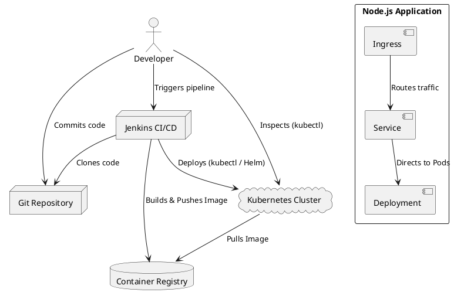

# Architecture Overview

This document outlines the high-level architecture of the `car_trawler_assessment` project, focusing on its components and their interactions within a Continuous Integration/Continuous Deployment (CI/CD) context.

## 1. High-Level Architecture Diagram

## 2. Component Breakdown

### 2.1. Developer Environment
* **Developer / DevOps Engineer**: The human user interacting with the system, developing code, defining infrastructure, and monitoring CI/CD processes.

### 2.2. Source Code Management
* **Git Repository**: The central version control system (e.g., GitHub, GitLab, Bitbucket) where all project code, configurations, and pipeline definitions are stored.

### 2.3. CI/CD System (Jenkins)
* **Jenkins Controller**: The master orchestration engine for the CI/CD pipeline. It fetches code from the Git repository, schedules build jobs, and dispatches tasks to Jenkins Agents.
* **Jenkins Agent (Docker Container)**: A specialized Docker container acting as a build executor. It's pre-configured with all necessary tools (Docker CLI, `kubectl`, `minikube`, Node.js, `yamllint`, `kubeval`, `git`) to perform pipeline stages like building Docker images, running tests, linting, and deploying to Kubernetes. It mounts the Docker socket from the host for local Docker operations.

### 2.4. Infrastructure Provisioning
* **Terraform**: An Infrastructure as Code (IaC) tool used to define and provision cloud resources, specifically the AWS EKS Kubernetes cluster, VPC, and associated networking components. Terraform commands are executed either locally by a developer or as part of the CI/CD pipeline.
* **AWS Cloud**: The target cloud provider where the production-grade Kubernetes cluster (EKS) and supporting infrastructure are deployed.

### 2.5. Kubernetes Cluster (EKS / Minikube)
This represents the runtime environment for the application. During development, this is typically a local Minikube cluster; in production, it's an AWS EKS cluster.

* **Node.js App Deployment**: A Kubernetes `Deployment` resource responsible for managing the desired state of the Node.js application (e.g., number of replicas, image version).
* **Node.js App Service**: A Kubernetes `Service` resource that provides a stable network endpoint for the Node.js application, allowing other services or the Ingress to access it.
* **Ingress Controller (e.g., Nginx)**: An essential component (like Nginx Ingress Controller in Minikube) that listens for Ingress rules and routes external HTTP/S traffic to the correct internal Kubernetes Services.
* **Node.js App Ingress**: A Kubernetes `Ingress` resource that defines rules for external access to the `Node.js App Service` based on hostnames and paths.
* **App ConfigMap**: A Kubernetes `ConfigMap` used to store non-sensitive configuration data for the Node.js application.
* **App Secret**: A Kubernetes `Secret` used to securely store sensitive configuration data (e.g., API keys, database passwords) for the Node.js application.
* **Container Registry (ECR / Minikube Daemon)**: A repository for Docker images. In a production AWS environment, this would be Amazon Elastic Container Registry (ECR). For Minikube, it typically refers to the local Docker daemon running within the Minikube VM.

## 3. Workflow Summary

1.  **Code Commit**: Developers push code (application, K8s manifests, IaC, Jenkinsfile) to the Git Repository.
2.  **CI/CD Trigger**: Jenkins detects changes and triggers the pipeline defined in `Jenkinsfile`.
3.  **Agent Provisioning**: Jenkins spins up a `Jenkins Agent` container equipped with all necessary tools.
4.  **Build & Test**: The agent checks out code, runs linting (shell script and K8s YAML), and executes application tests.
5.  **Image Build**: The agent builds the Docker image for the Node.js application and pushes it to a `Container Registry` (Minikube's daemon for local dev, ECR for production).
6.  **Deployment**:
    * For local development/testing, the agent uses `kubectl apply` to deploy resources directly to the `Minikube Cluster`.
    * For infrastructure provisioning (e.g., EKS), the agent executes `Terraform` commands against `AWS Cloud`.
    * For higher environments, `Helm` would be used to deploy the application in a templated and managed fashion.
7.  **Access**: External users can access the deployed application via the `Ingress Controller` and its rules.
8.  **Monitoring/Feedback**: Jenkins provides pipeline status, and developers can use `kubectl` to directly inspect the cluster.
